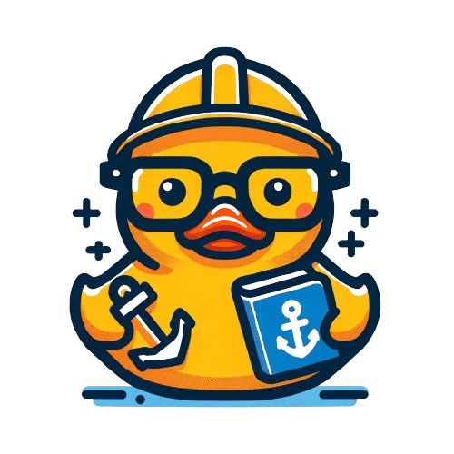

 &nbsp; 

  

<h3 align="center">A passionate frontend developer from Canary Island. But I love a good backend project.</h3>

  

 I'm a ...

  

    <i>steady person</i> 

  

 

  

    <i>easy learner</i> 

  

  

    <i>autonomous person</i> 

  

  

    <i>co-worker</i> 

  

  

    <i>positive person</i> 

  

<!-- Estas líneas en blanco crean un espacio extra -->

 

|  |  |
| ------------- | ------------- |
          
 

### Connect with me:

### STACK

&nbsp;
&nbsp;
&nbsp;
  
&nbsp;
&nbsp;
&nbsp;
&nbsp;   
  
&nbsp;
&nbsp;
&nbsp;
&nbsp;

&nbsp; 
&nbsp;
&nbsp;

&nbsp;
&nbsp;

&nbsp;
&nbsp;
&nbsp;
&nbsp;
&nbsp;
&nbsp; 

